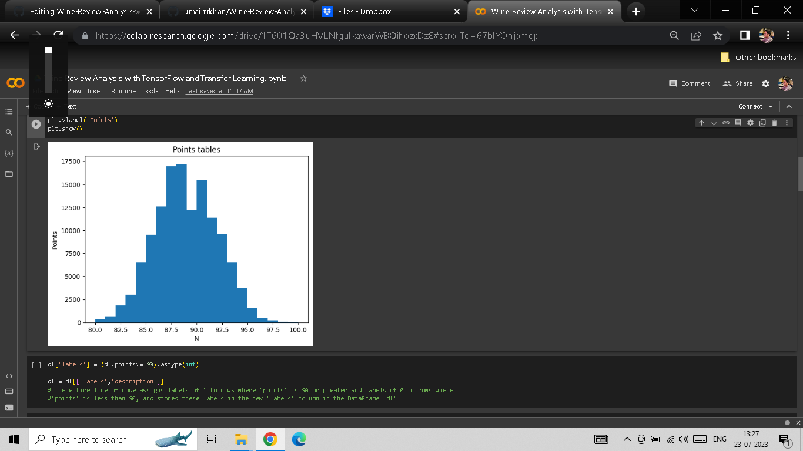
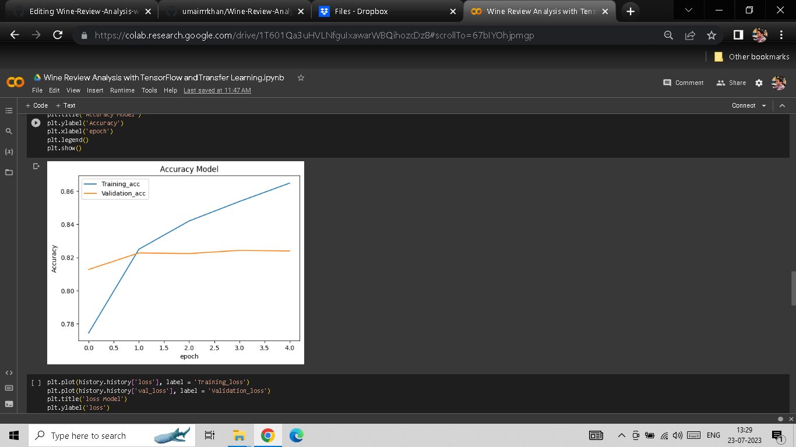
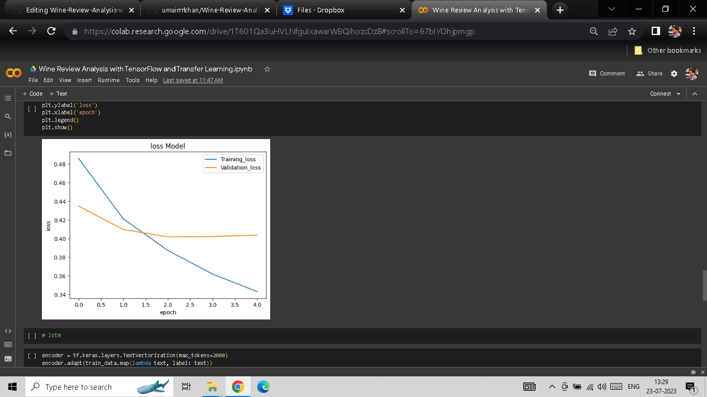
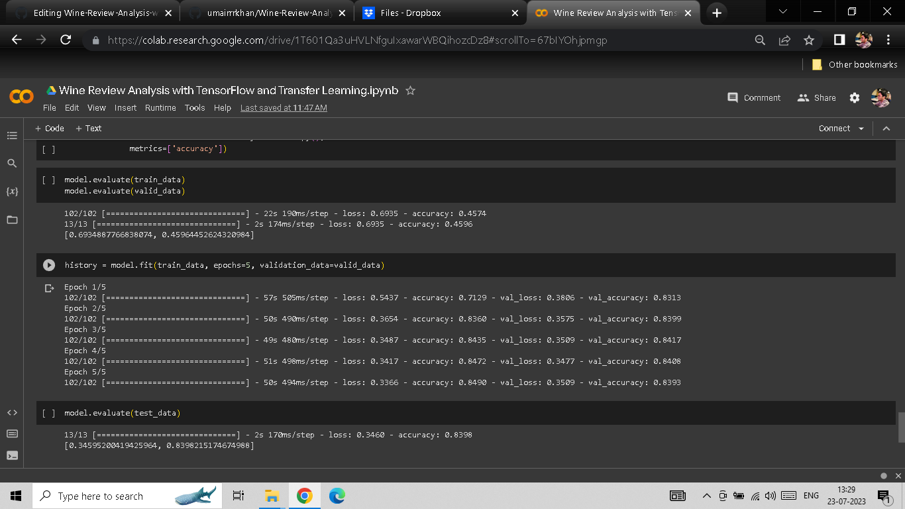

# Wine Review Analysis with TensorFlow and Transfer Learning

## Introduction

This project aims to analyze wine reviews using TensorFlow and Transfer Learning. The dataset used for analysis can be found in the 'wine-reviews.csv' file. The dataset contains valuable information about different wines, including their country of origin, description, points, price, variety, and winery. By leveraging TensorFlow's powerful machine learning capabilities and transfer learning techniques with TensorFlow Hub, we seek to extract insights from the wine reviews and perform various tasks such as sentiment analysis, variety prediction, or wine quality prediction.

## Dataset

The dataset used in this project is available in 'wine-reviews.csv'. It contains the following columns:
- 'country': The country of origin for the wine.
- 'description': The textual description of the wine.
- 'points': The points (rating) given to the wine.
- 'price': The price of the wine.
- 'variety': The variety or type of the wine.
- 'winery': The winery that produces the wine.

You can download the dataset from this link: [wine-reviews.csv]([link_to_dataset](https://www.dropbox.com/s/1huhkndjul5s7ku/wine-reviews.csv?dl=0))

## Tools and Libraries Used

The project utilizes the following tools and libraries:

- Python: The programming language used to implement the project.
- TensorFlow: An open-source machine learning library used for building, training, and deploying machine learning models.
- TensorFlow Hub: A library that provides pre-trained models and embeddings for TensorFlow.
- NumPy: A library for numerical computing in Python.
- pandas: A library for data manipulation and analysis in Python.
- matplotlib: A library for creating visualizations in Python.

## Screenshots

Screenshot 1:

Screenshot 2: 

Screenshot 3: 

Screenshot 4: 

## Project Workflow

The project's workflow can be broken down into the following steps:

1. Data Loading: The 'wine-reviews.csv' dataset is loaded into a pandas DataFrame for further analysis.
2. Data Exploration: The dataset is explored to understand its structure and distribution of data.
3. Data Preprocessing: Textual data may be cleaned and preprocessed before using it for analysis. This step may involve tokenization, removing stopwords, and stemming/lemmatization.
4. Transfer Learning: Pre-trained TensorFlow models from TensorFlow Hub are used to perform transfer learning on the textual data. These models offer powerful feature extraction capabilities that help us in our analysis.
5. Sentiment Analysis: The sentiment of wine reviews is determined to understand the overall perception of wines.
6. Variety Prediction: Based on the textual descriptions, we predict the variety or type of wine.
7. Wine Quality Prediction: Using the information in the dataset, we may build a model to predict the wine quality based on the provided features.
8. Visualization: Matplotlib is used to create visualizations, such as histograms, scatter plots, and bar charts, to provide insights into the data and model predictions.

## Conclusion

By the end of this project, we expect to have gained valuable insights into the wine reviews using TensorFlow and transfer learning. The visualizations and predictions will provide meaningful information for wine enthusiasts, winemakers, and anyone interested in understanding the sentiments and characteristics of different wines.

Feel free to explore the code and dataset to enhance your understanding of wine review analysis and TensorFlow-based machine learning.

Happy Analyzing!
